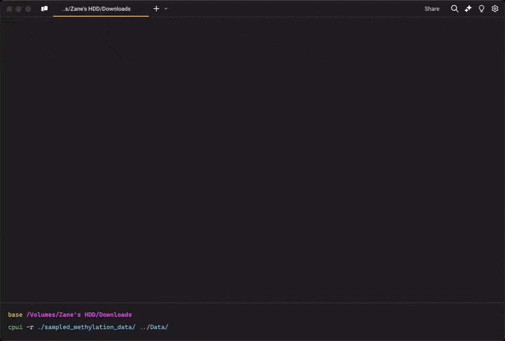

# 🚀 cpui

A modern, user-friendly command-line file copying tool that goes beyond being just a replacement for the traditional `cp` command. It provides a rich interactive interface and advanced features for efficient file management.



## ✨ Features

🔄 **Real-time Progress Tracking**

- Overall progress bar for total operation status
- Per-file progress indicator
- Live transfer speed monitoring
- Elegant TUI (Terminal User Interface) for clear visual feedback

🎯 **Smart Copy Control**

- Recursive directory copying
- Flexible file/directory exclusion patterns
- Attribute preservation options
- Graceful Ctrl+C interrupt handling

⚙️ **Advanced Capabilities**

- Asynchronous I/O for better performance
- Memory-efficient buffered transfers
- Cross-platform support (Unix and Windows)
- User-friendly error handling and status feedback

## 📥 Installation

Using Cargo:

```bash
cargo install cpui
```

Building from source:

```bash
git clone https://github.com/Bengerthelorf/cpui
cd cpui
cargo build --release
```

## 🎮 Usage Guide

### Basic Operations

Copy a single file:

```bash
cpui source.txt destination.txt
```

Copy a file to a directory:

```bash
cpui source.txt destination_directory/
```

### Directory Operations

Recursively copy a directory:

```bash
cpui -r source_directory destination_directory
```

### Advanced Options

Exclude specific files or directories:

```bash
# Single pattern
cpui -r source_dir dest_dir --exclude node_modules

# Multiple patterns
cpui -r source_dir dest_dir --exclude node_modules,target,.git

# Using wildcards
cpui -r source_dir dest_dir --exclude "*.tmp,*.log"
```

Preserve file attributes (permissions, timestamps, etc.):

```bash
cpui --preserve source.txt destination.txt
```

### Pro Tips 💡

1. **Large File Transfers**
   - Automatically displays transfer speed and estimated completion time
   - Safe interruption with Ctrl+C at any time
   - Memory-efficient buffered operations

2. **Directory Copying**
   - Use `-r` for recursive copying
   - Exclude unwanted files with `--exclude`
   - Monitor both overall progress and current file status

3. **File Attribute Management**
   - Preserve original attributes with `--preserve`
   - Maintains permissions, ownership, and timestamps
   - Cross-platform attribute handling

## 🔧 Command-Line Options

Available arguments:

- `SOURCE`: Source file or directory path
- `DESTINATION`: Destination file or directory path
- `-r, --recursive`: Enable recursive directory copying
- `--preserve`: Maintain file attributes
- `--exclude <PATTERN>`: Exclude files/directories matching patterns (comma-separated)

## 🤝 Contributing

We welcome contributions! Here's how you can help:

1. Fork the repository
2. Create your feature branch (`git checkout -b feature/AmazingFeature`)
3. Commit your changes (`git commit -m 'Add some AmazingFeature'`)
4. Push to the branch (`git push origin feature/AmazingFeature`)
5. Open a Pull Request

## 📃 Development Requirements

- Rust 1.75 or higher
- Cargo package manager

### Building for Development

```bash
# Clone the repository
git clone https://github.com/Bengerthelorf/cpui
cd cpui

# Run tests
cargo test

# Build in debug mode
cargo build

# Build for release
cargo build --release
```

## 📄 License

This project is licensed under the MIT License - see the [LICENSE](LICENSE) file for details.

## 👤 Author

Zane Leong (2025)

## 🌟 Acknowledgments

Thanks to all contributors who have helped shape this project!

---

If you find this tool useful, please give us a star ⭐! Your support motivates us to continue improving!

Having issues or suggestions? Feel free to raise an [Issue](https://github.com/Bengerthelorf/cpui/issues)!
